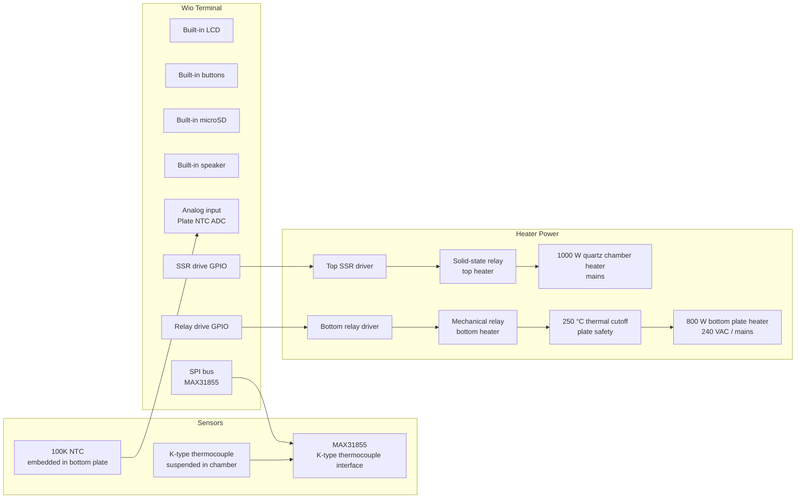

# Hardware Specification

Pita-flow is being adapted around a Wio Terminal local operator console for a
converted flat-bread maker / reflow oven.

The design goal is stable, repeatable PCB reflow temperature control while
keeping firmware timing deterministic and the local UI lightweight and
responsive.

## System Overview

The oven has two independently controlled mains-voltage heaters:

| Subsystem | Description | Power | Voltage | Switching device | Primary role |
|---|---:|---:|---:|---|---|
| Bottom plate heater | Embedded heater under the plate | 800 W | 240 VAC / mains | Mechanical relay | Preheat and soak assist; limited by configurable plate-temperature ceiling |
| Top chamber heater | Radiative quartz heater in chamber | 1000 W | Mains | Solid-state relay (SSR) | Primary reflow heater, especially during solder reflow/liquidus phase |

The bottom plate heater is switched using a **mechanical relay**, while the top
quartz heater is switched using a **solid-state relay (SSR)**. Both channels
use **slow time-proportional PWM** with a nominal **1 second control window**
for consistency, even though the SSR is capable of much faster switching; this
keeps the bottom heater's mechanical relay within a reasonable
switching-cycle lifetime and keeps the control scheme identical for both
channels.

> Safety note: this project controls mains-voltage heaters. Relay and SSR
> drive, isolation, fusing, grounding, enclosure, wiring clearances, strain
> relief, SSR heatsinking, and emergency shutdown must be designed and reviewed
> appropriately before hardware is energized.

## Wio Terminal Operator Console

The Wio Terminal contributes the local operator interface:

| Built-in feature | Planned role |
|---|---|
| IPS LCD | Show selected profile, active phase, temperatures, heater outputs, and faults |
| Three front buttons | Previous profile, start/stop/acknowledge, next profile |
| microSD slot | Store the `reflow-profiles.yaml` catalog |
| Speaker | Audible feedback for selection changes, phase transitions, completion, and fault alarms |

These built-in resources reduce external wiring and make the oven operable
without a browser or separate control panel.

## Sensors and Safety Devices

| Sensor / safety device | Location | Interface | Purpose |
|---|---|---|---|
| 100K NTC thermistor | Embedded in bottom plate | Wio Terminal analog input via voltage divider | Measures plate temperature; used to limit and control bottom heater |
| K-type thermocouple | Suspended above plate in oven chamber | MAX31855 thermocouple interface over SPI | Measures chamber/process temperature; primary profile-control sensor |
| 250 °C thermal cutoff switch | Bottom plate | Hardware safety cutoff | Independent plate over-temperature protection |

## Thermal Control Philosophy

The two heaters have different functions and should not be treated as identical
heat sources.

| Reflow phase | Bottom plate heater | Top quartz heater | Notes |
|---|---|---|---|
| Idle | Off | Off | System waits safely below configured limits |
| Preheat | Enabled, plate-temperature limited | Enabled | Both heaters can help raise board/chamber temperature |
| Soak | Enabled as needed, plate-temperature limited | Enabled | Bottom heater supports thermal mass without overheating PCB substrate |
| Reflow / liquidus | Normally disabled or heavily limited | Enabled | Top heater performs most of the reflow work |
| Cooldown | Off | Off | Cooling is passive unless future hardware adds fan/vent control |
| Fault | Off | Off | Any critical fault disables both relays |

The bottom plate temperature ceiling is a **firmware-configurable parameter**.
It is intentionally not hardcoded in the hardware design, because it will need
tuning based on board material, oven behavior, profile type, and measured
temperature gradients.

## External Wiring Summary

The Wio Terminal already provides the screen, buttons, microSD slot, and
speaker, so the external harness only needs to cover the oven I/O:

| Signal | Direction | Notes |
|---|---|---|
| MAX31855 SCK / MISO / CS | MCU ↔ sensor | Use the Wio Terminal hardware SPI bus with a dedicated CS line |
| Plate NTC ADC | Input | Route the divider node to a Wio Terminal analog-capable input |
| Bottom heater relay drive | Output | Time-proportional mechanical relay control; must default safe/off |
| Top heater SSR drive | Output | Time-proportional SSR control; must default safe/off |
| Thermal cutoff chain | Hardware interlock | Remains in series with the bottom heater regardless of firmware state |

### Bottom Heater Relay Drive Requirements (Mechanical Relay)

The selected Wio Terminal GPIO must not drive the relay coil directly. The
bottom heater relay channel should include, as appropriate for the selected
relay module or discrete circuit:

- transistor or MOSFET driver stage,
- flyback diode for DC relay coils,
- opto-isolation if using an isolated relay module,
- defined default-off behavior during reset/boot,
- adequate mains isolation between low-voltage and mains wiring.

### Top Heater SSR Drive Requirements (Solid-State Relay)

The selected Wio Terminal GPIO drives the top quartz heater through a
solid-state relay (SSR) rather than a mechanical relay. Requirements differ
from the mechanical relay channel:

- series current-limiting resistor sized for the SSR's input LED, unless the
  selected SSR module already includes its own input conditioning circuitry,
- prefer a zero-cross switching SSR to reduce electrical noise and inrush
  current, unless phase-angle control is intentionally required,
- opto-isolation is inherent to the SSR itself, but low-voltage control wiring
  and mains-side output terminals must still be kept physically separated with
  adequate creepage/clearance,
- adequate heatsinking for the SSR output stage, sized for the 1000 W load and
  expected duty cycle, since SSRs dissipate heat across their output junction
  unlike mechanical relay contacts,
- snubber circuit (RC or MOV) across the SSR output if required by the
  manufacturer, particularly for inductive or high inrush loads,
- defined default-off behavior during reset/boot (control line must not float
  high while the MCU is booting/resetting),
- confirm SSR current/voltage rating includes an appropriate safety margin above
  the 1000 W steady-state load current.

## Connection Diagram

## Open Hardware Decisions

- Finalize the exact Wio Terminal external pin assignments for SPI chip-select,
  analog NTC input, and the two heater outputs.
- Confirm bottom heater mechanical relay module electrical interface and whether
  inputs are active-high or active-low.
- Confirm top heater SSR part number, control input range/current, zero-cross vs
  random-fire switching, and heatsink requirements.
- Define NTC divider resistor value, ADC attenuation, filtering, and
  calibration method.
- Decide whether to add a fan, door/cover switch, or emergency-stop input in a
  later revision.
