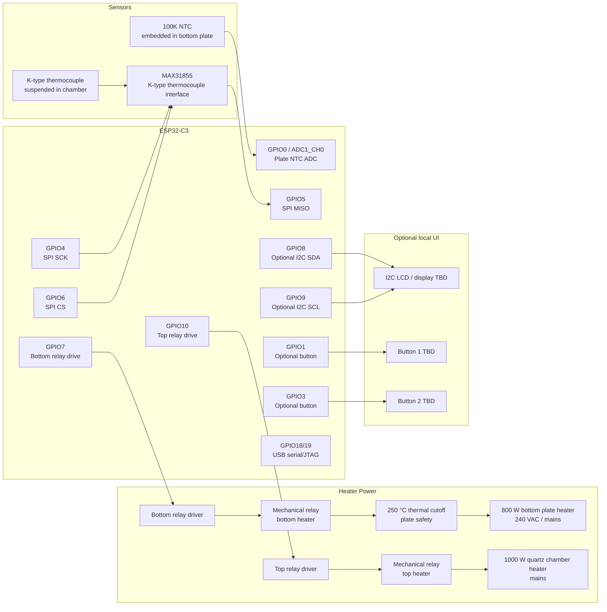

# Hardware Specification

Pita-flow is an ESP32-C3 based controller for a converted flat-bread maker / reflow oven.

The design goal is stable, repeatable PCB reflow temperature control while keeping firmware timing deterministic and the web/UI layer lightweight.

## System Overview

The oven has two independently controlled mains-voltage heaters:

| Subsystem | Description | Power | Voltage | Primary role |
|---|---:|---:|---:|---|
| Bottom plate heater | Embedded heater under the plate | 800 W | 240 VAC / mains | Preheat and soak assist; limited by configurable plate-temperature ceiling |
| Top chamber heater | Radiative quartz heater in chamber | 1000 W | Mains | Primary reflow heater, especially during solder reflow/liquidus phase |

The two heaters are controlled by separate **mechanical relays**. Because the relays are mechanical, heater power control is done using **slow time-proportional PWM** with a nominal **1 second control window**.

> Safety note: this project controls mains-voltage heaters. Relay drive, isolation, fusing, grounding, enclosure, wiring clearances, strain relief, and emergency shutdown must be designed and reviewed appropriately before hardware is energized.

## Sensors and Safety Devices

| Sensor / safety device | Location | Interface | Purpose |
|---|---|---|---|
| 100K NTC thermistor | Embedded in bottom plate | ESP32-C3 ADC input via voltage divider | Measures plate temperature; used to limit and control bottom heater |
| K-type thermocouple | Suspended above plate in oven chamber | MAX31855 thermocouple interface over SPI | Measures chamber/process temperature; primary profile-control sensor |
| 250 °C thermal cutoff switch | Bottom plate | Hardware safety cutoff | Independent plate over-temperature protection |

## Thermal Control Philosophy

The two heaters have different functions and should not be treated as identical heat sources.

| Reflow phase | Bottom plate heater | Top quartz heater | Notes |
|---|---|---|---|
| Idle | Off | Off | System waits safely below configured limits |
| Preheat | Enabled, plate-temperature limited | Enabled | Both heaters can help raise board/chamber temperature |
| Soak | Enabled as needed, plate-temperature limited | Enabled | Bottom heater supports thermal mass without overheating PCB substrate |
| Reflow / liquidus | Normally disabled or heavily limited | Enabled | Top heater performs most of the reflow work |
| Cooldown | Off | Off | Cooling is passive unless future hardware adds fan/vent control |
| Fault | Off | Off | Any critical fault disables both relays |

The bottom plate temperature ceiling is a **firmware-configurable parameter**. It is intentionally not hardcoded in the hardware design, because it will need tuning based on board material, oven behavior, profile type, and measured temperature gradients.

## Proposed ESP32-C3 Pinout

The current pinout avoids using boot-sensitive strapping pins for heater relay outputs and reserves the native USB pins for programming/debugging.

| Signal | ESP32-C3 GPIO | Direction | Notes |
|---|---:|---|---|
| MAX31855 SCK | GPIO4 | Output | SPI clock for thermocouple interface |
| MAX31855 MISO / SO | GPIO5 | Input | MAX31855 is read-only; no MOSI required |
| MAX31855 CS | GPIO6 | Output | Thermocouple chip select |
| Plate NTC ADC | GPIO0 / ADC1_CH0 | Input | Voltage divider input for 100K NTC |
| Bottom heater relay drive | GPIO7 | Output | Time-proportional relay control; must default safe/off |
| Top heater relay drive | GPIO10 | Output | Time-proportional relay control; must default safe/off |
| Optional I2C SDA | GPIO8 | I/O | Reserved for possible LCD/UI; strapping pin, use carefully |
| Optional I2C SCL | GPIO9 | I/O | Reserved for possible LCD/UI; strapping pin, use carefully |
| Optional button 1 | GPIO1 | Input | Future local UI input, preferably interrupt-capable |
| Optional button 2 | GPIO3 | Input | Future local UI input, preferably interrupt-capable |
| USB D- / D+ | GPIO18 / GPIO19 | Reserved | Native USB serial/JTAG/programming |

### Relay Drive Requirements

The ESP32-C3 pins must not drive relay coils directly. Each relay channel should include, as appropriate for the selected relay module or discrete circuit:

- transistor or MOSFET driver stage,
- flyback diode for DC relay coils,
- opto-isolation if using an isolated relay module,
- defined default-off behavior during reset/boot,
- adequate mains isolation between low-voltage and mains wiring.

## Connection Diagram

## Open Hardware Decisions

- Confirm exact ESP32-C3 module/dev board variant and available pins.
- Confirm relay module electrical interface and whether inputs are active-high or active-low.
- Define NTC divider resistor value, ADC attenuation, filtering, and calibration method.
- Confirm LCD/display type if local UI is added.
- Decide whether to add a buzzer, fan, door/cover switch, or emergency-stop input in a later revision.
